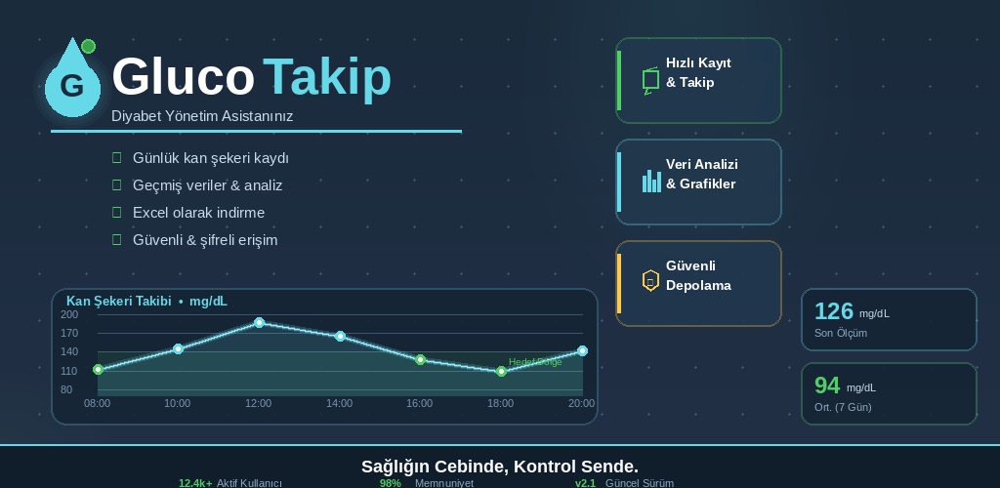
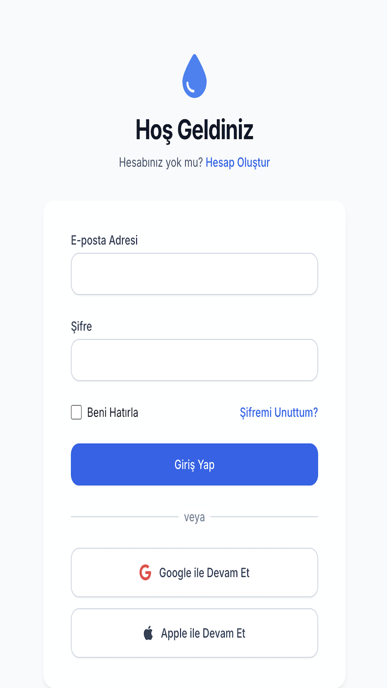
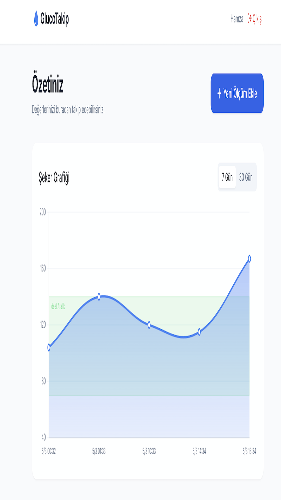
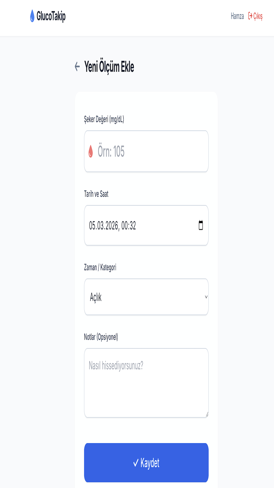
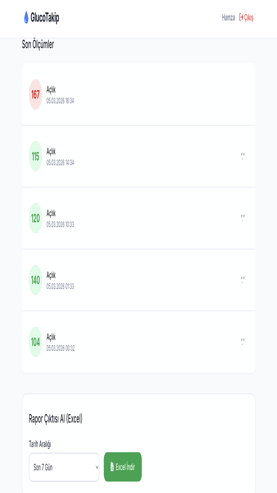

<div align="center">
  
  
  # 🩸 GlucoTakip - Akıllı Şeker Asistanı
  
  **Sağlığın Cebinde, Kontrol Sende!** 🚀
  
  <p>
    
    
    
    
  </p>
</div>



Babalarımızın ve değerli diyabet hastalarının kan şekeri ölçümlerini bir kağıda yazıp kaybetme derdine son! **GlucoTakip**, sağlık verilerini kolayca ve güvenle takip etmenizi sağlayan, doktor randevularında tek tıkla profesyonel bir Excel raporu sunabilen modern ve kullanıcı dostu bir akıllı web uygulamasıdır. Sağlığınız parmaklarınızın ucunda, kayıt altında ve güvende! 🛡️

---

## ✨ Öne Çıkan Özellikler

- ⚡ **Işık Hızında Backend:** FastAPI altyapısıyla desteklenen, anlık veri işleyen süper hızlı mimari.
- 🔐 **Tek Tıkla Güvenli Giriş (OAuth2):** Şifre ezberlemeye son! Google veya Apple hesabınızla güvenle ve hızlıca sisteme girin.
- 🎨 **Modern ve Ferah Tasarım:** TailwindCSS kullanılarak geliştirilen, mobilde ve masaüstünde harika görünen cam gibi (glassmorphism) arayüz.
- 📈 **Görsel Trend Analizi:** Chart.js entegrasyonu sayesinde haftalık ve aylık şeker değişimlerinizi "İdeal Aralık" hedef bantlarıyla görsel olarak takip edin.
- 📑 **Doktor İçin Excel Raporu:** Girilen verilerinizi tek tıkla filtreleyin ve doktorunuza sunmak üzere derli toplu `.xlsx` (Excel) dosyası olarak anında indirin.
- 🤖 **Simülasyon ve Data Seeding:** Yeni özellikler denerken sistemi verilerle doldurmak için tasarlanmış gerçekçi otomatik test simülasyonu betiği!

---

## 📸 Uygulama İçi Görseller (Demo)

### 1. Güvenli ve Hızlı Giriş 🚪
Kullanıcıların şifre hatırlamakla uğraşmadan Google veya Apple hesaplarıyla sisteme saniyeler içinde giriş yaptığı o akıcı deneyim.
<div align="center">
  
</div>

### 2. Özet ve Veri Grafiği 📊
Geçmiş ölçümlerinizin haftalık veya aylık periyotlarda, ideal aralıklarla birlikte görselleştirilmiş hali.
<div align="center">
  
</div>

### 3. Yeni Ölçüm Ekleme 🩸
Saniyeler içinde yeni bir açlık/tokluk kan şekeri değeri girebileceğiniz modern form ekranı.
<div align="center">
  
</div>

### 4. Geçmiş Kayıtlar ve Excel Çıktısı 📥
Tüm ölçüm geçmişinize göz atın ve doktorunuz için tek tıkla Excel formatında indirin.
<div align="center">
  
</div>

---

## 🗺️ Yol Haritası (Roadmap)

- [x] Proje İskeletinin Kurulması (FastAPI & SQLite)
- [x] Kullanıcı Kayıt & Giriş (Auth) Sistemi
- [x] Google / Apple SSO Entegrasyonu
- [x] Ölçüm Ekleme, Listeleme ve Grafik Ekranları
- [x] Excel Çıktısı Alma (Export Endpoint)
- [x] Otomatik Test Simülasyonu Yazılması
- [x] Docker ile Paketleme ve Deploy
- [ ] Kullanıcı Sözleşmesi ve Veri İzni (AI Çalışmaları İçin)

---

## 🛠️ Kurulum ve Çalıştırma

Projeyi lokal bilgisayarınızda çalıştırmak oldukça basittir:

**1. Gereksinimleri Yükleyin:** Terminalinizde projenin ana dizinindeyken bağımlılıkları yükleyin:
```bash
pip install -r requirements.txt